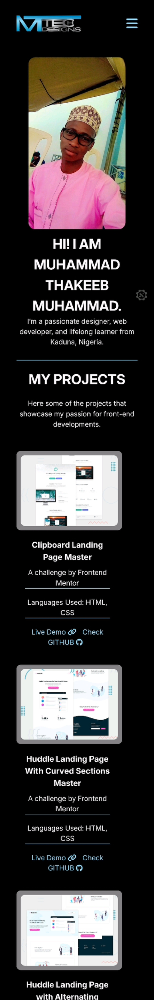
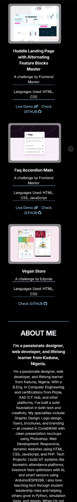

# 💼 MT Tech Designs Portfolio

Welcome to the official portfolio of **Muhammad Thakeeb Muhammad** — a passionate front-end developer, graphic designer, and lifelong learner from Kaduna, Nigeria.

---

## 🚀 Live Preview

👉 [View the Website](https://thakeeb22.github.io/mt-tech-designs/)

---

## 📌 About the Project

This is a fully responsive personal portfolio site that showcases:

- My bio and tech background
- Selected front-end and design projects
- A working contact form with a custom thank-you page

---

## 🎨 Features

- 🔥 Stylish dark-themed layout
- ✨ Smooth hover animations
- 📱 Fully responsive design (mobile + desktop)
- 📂 Live project previews with GitHub links
- 📩 Working contact form powered by [FormSubmit](https://formsubmit.co)
- ✅ Custom thank-you page after form submission

---

## 🛠️ Built With

- **HTML5**
- **CSS3**
- **Font Awesome**
- **Google Fonts** (`Inter`)
- **FormSubmit** – contact form backend
- **GitHub Pages** – for hosting

---

## 📷 Screenshots

### 🖥️ Desktop View

### 📱 Mobile View

---

## 📁 Folder Structure

mt-tech-designs/
│
├── img/ # Images and logos
├── my resume/ # Resume PDF
├── style.css # Main CSS stylesheet
├── index.html # Main portfolio page
├── thank-you.html # Thank you redirect page
└── README.md # Project documentation

---

## 📫 Contact Me

- 📧 Email: [thakeebmuhammad@gmail.com](mailto:thakeebmuhammad@gmail.com)
- 🐙 GitHub: [@Thakeeb22](https://github.com/Thakeeb22)
- 🐦 Twitter: [@MuhammadThakeeb](https://x.com/MuhammadThakeeb)
- 💬 WhatsApp: [Chat with me](https://wa.me/2348104127389)

---

## 🧠 Future Improvements

- ✅ Add filtering to project section with JavaScript
- 🔧 Backend form handling with PHP/Node.js
- 🎞️ Enhance animations using GSAP or Framer Motion
- 🗣️ Add blog or testimonial section

---

## 📄 License

This project is licensed under the [MIT License](./LICENSE).

---

> _Designed and developed by Muhammad Thakeeb Muhammad — MT Tech Designs_
