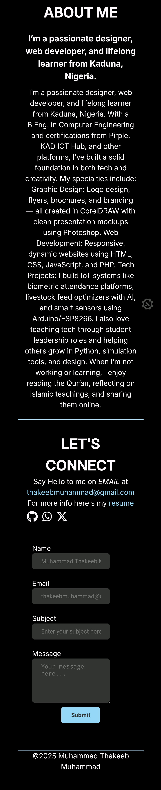

# 💼 MT Tech Designs Portfolio

Welcome to the official portfolio of **Muhammad Thakeeb Muhammad**, a passionate front-end developer, graphic designer, and lifelong learner from Kaduna, Nigeria.

## 🚀 Live Preview

👉 [View the Website](https://thakeeb22.github.io/your-repo-name/)

---

## 📌 About the Project

This is a fully responsive personal portfolio site that showcases:
- My bio and tech background
- Selected front-end and design projects
- A working contact form with redirect to a thank-you page

---

## 🎨 Features

- 🔥 Stylish dark-themed layout
- ✨ Smooth animations on hover
- 📱 Fully responsive design for mobile and desktop
- 📂 Live project previews with GitHub links
- 📩 Working contact form powered by [FormSubmit](https://formsubmit.co)
- ✅ Custom “Thank You” page

---

## 🛠️ Technologies Used

- HTML5
- CSS3
- Font Awesome
- Google Fonts (`Inter`)
- FormSubmit (for the contact form)
- GitHub Pages (for deployment)

---

## 📷 Screenshots

## Desktop view

## Mobile View

---

## 📁 Folder Structure

My Portfolio/
│
├── img/ # Images and logo
├── my resume/ # Resume PDF
├── style.css # Main CSS file
├── index.html # Main site
├── thank-you.html # After form submission
└── README.md # This file

---

## 📫 Contact

- Email: [thakeebmuhammad@gmail.com](mailto:thakeebmuhammad@gmail.com)
- GitHub: [Thakeeb22](https://github.com/Thakeeb22)
- Twitter: [@MuhammadThakeeb](https://x.com/MuhammadThakeeb)
- WhatsApp: [Chat on WhatsApp](https://wa.me/2348104127389)

---

## 🧠 Future Improvements

- Add project filtering with JavaScript
- Add backend contact form handling with PHP or Node.js
- Improve animations with GSAP or Framer Motion
- Add blog or testimonial sections

---

## 📄 License

This project is open-source and free to use under the [MIT License](LICENSE).

---

_Designed and developed by Muhammad Thakeeb Muhammad — MT Tech Designs_
